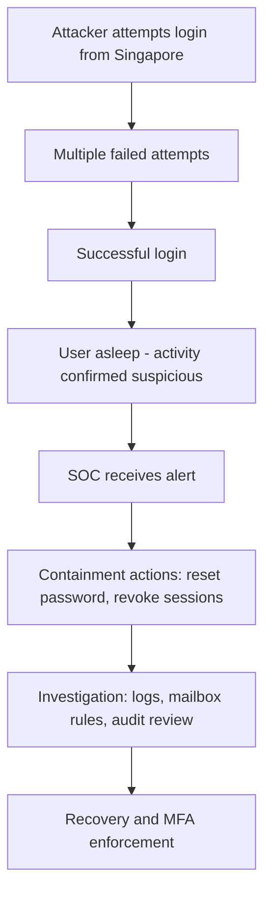

#  SOC Investigation — Suspicious Login Activity
**Case Study: Unauthorized Access Attempt in Microsoft 365  
Status: Closed — Credentials Compromised
Severity: High**

## Executive Summary

A Brisbane‑based employee’s Microsoft 365 account showed multiple failed login attempts from a foreign IP address (Singapore), followed by a successful authentication while the user was asleep. The pattern strongly indicates credential compromise via password spraying or credential stuffing. Immediate containment actions were taken to secure the account, revoke sessions, and enforce MFA.


### This case demonstrates:

+ Identity‑based threat detection

+ KQL log analysis

+ MITRE ATT&CK mapping

+ Analyst reasoning

+ Containment workflow
  
   
## Case Objectives

+ Determine whether the login was legitimate or malicious

+ Identify the source and method of compromise

+ Assess potential lateral movement

+ Contain the account and prevent further misuse

+ Provide remediation and long‑term recommendations

 ## User and Alert Details 
| Field                  |  Details
| ---------------------- | ------------------------------- | 
|  User                  | jane.harris@brisbanetech.com.au |
|  Normal location       |  Brisbane, Qld                  |
|    Suspicious location |  Singapore                      |
|   Time of alert        |  2:14 AEST                      |
|   Alert source         |  Azure AD identity protection   |
| Authentication method  |  Password only (no MFA)         |


## Case Summary
A user account belonging to a Brisbane-based employee showed multiple failed login attempts from a foreign IP address, followed by a successful authentication while the user was asleep. The activity originated from Singapore and occurred in the absence of MFA, strongly indicating credential compromise. Immediate containment and investigation actions were required to secure the account and prevent lateral movement.

---

##  Scenario Overview
A small business uses Microsoft 365 for identity and email. The SOC receives an alert indicating multiple failed login attempts followed by a successful login from an unusual location. The user confirms they were asleep at the time of the successful authentication.

## Initial Log Review (Azure Sentinel)

### **KQL Query Used**
```
SigninLogs
| where UserPrincipalName == "jane.harris@brisbanetech.com.au"
| project TimeGenerated, UserPrincipalName, IPAddress, Location, ResultType, ResultDescription
```
### **Sample Output**

| Time Generated (AEST)     | IP    | Location  | Result | Description | 
|---------------------------|-------|-----------|--------|-------------|
| 02:06:14 |  203.0.113.55 | Singapore | 50053| Invalid username or password |
| 02:06:47 | 203.0.113.55  | Singapore | 50053 | Invalid username or password |
| 02:07:12 | 203.0.113.55  | Singapore | 50053 | Invalid username or password |
| 02:07:45 | 203.0.113.55  | Singapore | 50053 | Invalid username or password |
| 02:14:00 | 203.0.113.55  | Singapore | 0     | Success |

## Analyst Assessment

### Indicators of Compromise

+ Multiple failed attempts from a foreign IP

+ Successful login shortly after repeated failures

+ User confirms no activity at that time

+ No MFA enabled

+ High-risk sign-on flagged by identity protection
  

### Likely Attack Pattern

+ Password spraying

+ Credential stuffing

+ Phishing‑derived credentials

### Risk level: High

The attacker successfully authenticated and could have accessed email, files, or attempted lateral movement.

## Containment Actions

### Immediate

 + Forced password reset 
 
 + Revoked all active sessions 
 
 + Blocked the suspicious IP
 
 + Enabled MFA for the user

### Investigation

+ Reviewed sign‑in logs for lateral movement

+ Checked mailbox rules for forwarding or deletion

+ Reviewed audit logs for privilege escalation

+ Searched for additional failed attempts across the tenant

### Recovery

+ Verified no unauthorised mailbox rules

+ Confirmed no privilege escalation

+ Re‑enabled access with MFA enforced

  ## MITRE ATT&CK Mapping

| Tactic  |  Technique  |  ID  |  Why it applies  |
|---------|-------------|------|------------------|
| Valid Accounts  |	T1078	 |  Attacker used compromised credentials to log in  |
|Password Spraying / Stuffing	| T1110	 | Multiple failed attempts indicate brute‑force patterns |
|	Valid Accounts  |	T1078.004	|  Successful login using legitimate credentials bypasses detection  |
| Account Discovery	| T1087	 |  Likely enumeration before login  |
| Account Manipulation |	T1098	| Risk of mailbox rule creation or persistence |


### Lessons Learned
   
Enforce MFA tenant‑wide

Implement conditional access policies

Enable risk‑based sign‑in alerts

Educate users on password hygiene

## Future Enhancements for This Repo

Full SOC investigation template

Triage flowchart

MITRE ATT&CK mapping

KQL cheat sheet

“How to write a SOC case study” guide

Additional scenarios (phishing, malware, insider threat, etc.)

## 🕒 Timeline of Events

| Time (AEST)            | Event Description                                      |
|------------------------|--------------------------------------------------------|
| 02:06:14               | Failed login attempt from Singapore (203.0.113.55)     |
| 02:06:47               | Failed login attempt from same IP                      |
| 02:07:12               | Failed login attempt from same IP                      |
| 02:07:45               | Failed login attempt from same IP                      |
| 02:14:00 (approx.)     | Successful login from Singapore                        |
| 08:00                  | User reports they were asleep during the activity      |
| 08:10                  | SOC initiates investigation and containment actions     |

## 🧬 MITRE ATT&CK Mapping

| Tactic              | Technique                     | ID        | Relevance to Case                                      |
|---------------------|-------------------------------|-----------|--------------------------------------------------------|
| Initial Access      | Valid Accounts                | T1078     | Attacker used compromised credentials to log in        |
| Credential Access   | Credential Stuffing / Spraying| T1110     | Multiple failed attempts indicate password attacks     |
| Defense Evasion     | Valid Accounts                | T1078.004 | Successful login using legitimate credentials          |
| Discovery           | Account Discovery             | T1087     | Possible enumeration attempts prior to login           |
| Impact (Potential)  | Account Manipulation          | T1098     | Risk of mailbox rule creation or persistence           |

## 📊 Incident Flow Diagram (Mermaid)



## 📁 Repository Structure

```
soc-investigation-suspicious-logins/
├── README.md
├── diagrams/
│   └── incident-flow.mmd
├── logs/
│   └── sample-signinlogs.csv
├── queries/
│   └── signinlogs-query.kql
├── reports/
│   └── analyst-summary.md
└── artifacts/
    └── ioc-list.txt
```


